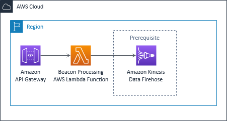

# aws-serverless-tracking-pixel

This solution deploys a lambda function and an API Gateway HTTP API to process tracking information from the HTTP request, returning a 1x1 transparent pixel so it can be invoked from an IMG HTML tag.
The processing AWS Lambda Function sends the parsed information to an Amazon Kinesis Data Firehose Stream that should already exist.
This solution is created as a baseline to be modified so it adapts to the specific use-case, according to the incoming information that should be processed.

## Solution architecture

The solution is built on top of serverless components



## Deploying the solution

This project is built using the AWS Serverless Application Model (SAM), a framework extending AWS CloudFormation syntax to easily define serverless components such as AWS Lambda functions or Amazon DynamoDB tables.

The following tools are required to deploy it:

* [AWS SAM CLI](https://docs.aws.amazon.com/serverless-application-model/latest/developerguide/serverless-sam-cli-install.html)
* [Python 3](https://www.python.org/downloads/)
* [Docker](https://hub.docker.com/search/?type=edition&offering=community)

The following resources act as a prerequisit:
* Amazon Kinesis DataFirehose delivery stream: A delivery stream should already exist in the same account and the same region where the solution will be deployed

To build and deploy for the first time, run the following in your shell:

```bash
sam build --use-container
sam deploy --guided
```

The first command will build the source of your application. The second command will package and deploy your application to AWS, with a series of prompts. If you choose to save your choices to `samconfig.toml`, then you no longer will need to pass the `--guided` flag, as the SAM CLI will read your settings from it.

### Template parameters
* `KinesisFirehoseARN`: ARN of the Amazon Kinesis DataFirehose delivery stream where the processed information will be published to.
* `KinesisFirehoseStreamName`: Stream name of the previous delivery stream.

### Template output
* `TrackingPixelProcessingAPIURL`: URL endpoint to send the tracking information to.

## How to use

The Amazon Lambda Function code should be modified to parse the desired HTTP request information. The example implementation extracts 5 different fields:
* `date`: Time field of the HTTP request context.
* `ip`: x-forwarded-for field of the HTTP request context, as Amazon API Gateway will place the original requester IP in this field.
* `userAgent`: user-agent field of the HTTP request context.
* `userId`: Custom parameter expected on the query string, called 'userid'.
* `thirdPartyId`: Custom parameter expected on the query string, called 'thirdpartyname'.

Once customized, you can directly begin tracking interactions from web pages or emails from an HTML IMG tag, or from any other event producer you might consider by generating HTTP-GET requests to the URL of the template output. As an example, this would be an HTTP call for the example implementation:

```bash
wget https://<your template output domain>?userid=aws_user&thirdpartyname=example.hightrafficwebsite.com”
```

## Developing

You can build with the following command:

```bash
sam build --use-container
```

The function can be locally invoked using `sam local invoke`. The `events` directory contains test events that can be passed on the function invocation.

```bash
sam local invoke TrackingPixelProcessing --event events/event.json
```
